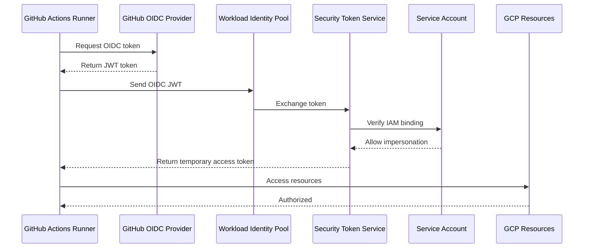
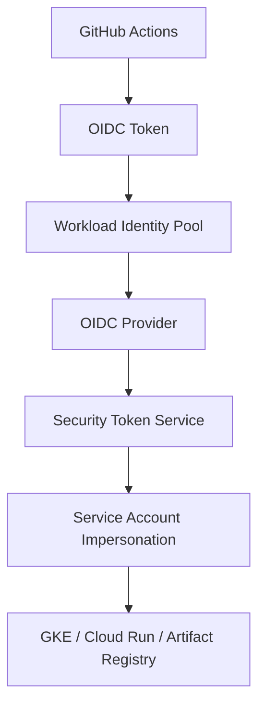

# Workload Identity Federation (WIF) with GitHub Actions

## Overview

Workload Identity Federation (WIF) allows GitHub Actions to authenticate to GCP without storing long-lived Service Account JSON keys in GitHub Secrets.

Traditional approach:

```text
GitHub Secret
    ↓
service-account.json
    ↓
GCP
```

WIF approach:

```text
GitHub OIDC Token
    ↓
Workload Identity Federation
    ↓
Service Account Impersonation
    ↓
GCP Resources
```

Benefits:

- No long-lived credentials
- Reduced credential leakage risk
- Short-lived access tokens
- Better auditing
- Follows GCP security best practices

---

# Authentication Flow

The following sequence illustrates authentication from GitHub Actions into GCP using WIF.



---

# Architecture



---

# Core Components

## Workload Identity Pool

Represents a container of external identities.

Example:

```text
github-pool
```

---

## Workload Identity Provider

Defines the OIDC provider.

Example issuer:

```text
https://token.actions.githubusercontent.com
```

Attribute mapping:

```text
google.subject=assertion.sub

attribute.actor=assertion.actor

attribute.repository=assertion.repository

attribute.repository_owner=assertion.repository_owner
```

---

## Service Account

Example:

```text
github-ci@my-project.iam.gserviceaccount.com
```

GitHub Actions impersonates this service account.

Typical roles:

- Artifact Registry Writer
- GKE Developer
- Cloud Run Admin

---

# Create Workload Identity Pool

```bash
gcloud iam workload-identity-pools create github-pool \
--project=my-project \
--location=global \
--display-name="Github Pool"
```

---

# Create Provider

```bash
gcloud iam workload-identity-pools providers create-oidc github-provider \
--location=global \
--workload-identity-pool=github-pool \
--issuer-uri="https://token.actions.githubusercontent.com" \
--attribute-mapping="google.subject=assertion.sub,attribute.actor=assertion.actor,attribute.repository=assertion.repository"
```

---

# Create Service Account

```bash
gcloud iam service-accounts create github-ci
```

---

# Grant Workload Identity Permission

```bash
gcloud iam service-accounts add-iam-policy-binding \
github-ci@my-project.iam.gserviceaccount.com \
--role=roles/iam.workloadIdentityUser \
--member="principalSet://iam.googleapis.com/projects/PROJECT_NUMBER/locations/global/workloadIdentityPools/github-pool/attribute.repository/my-org/my-repo"
```

This configuration ensures only:

```text
my-org/my-repo
```

can impersonate this service account.

---

# GitHub Actions Example

```yaml
name: Deploy

on:
  push:
    branches:
      - main

permissions:
  contents: read
  id-token: write

jobs:

  deploy:

    runs-on: ubuntu-latest

    steps:

      - uses: actions/checkout@v4

      - id: auth
        uses: google-github-actions/auth@v3
        with:
          workload_identity_provider: projects/123456789/locations/global/workloadIdentityPools/github-pool/providers/github-provider
          service_account: github-ci@my-project.iam.gserviceaccount.com

      - uses: google-github-actions/setup-gcloud@v3

      - run: gcloud auth list

      - run: gcloud container clusters get-credentials my-cluster --region asia-southeast1

      - run: kubectl get pods
```

---

# Required Workflow Permission

GitHub workflow must include:

```yaml
permissions:
  contents: read
  id-token: write
```

Without:

```yaml
id-token: write
```

authentication will fail.

Example:

```text
Failed to obtain OIDC token
```

---

# Common Issues

## PERMISSION_DENIED

Possible causes:

- Incorrect IAM binding
- Repository mismatch
- Missing Service Account role

Validate:

```bash
gcloud iam service-accounts get-iam-policy \
github-ci@my-project.iam.gserviceaccount.com
```

---

## unauthorized_client

Cause:

Incorrect OIDC issuer.

Expected:

```text
https://token.actions.githubusercontent.com
```

---

## attribute condition failed

Cause:

Repository does not match configured identity condition.

Expected:

```text
my-org/my-repo
```

Actual:

```text
another-org/test
```

---

# Security Best Practices

✓ Never use Service Account JSON keys

✓ Restrict repository scope

✓ Restrict branch scope

✓ Apply least privilege

✓ Use separate Service Accounts by environment

Recommended:

```text
github-dev-sa
github-stg-sa
github-prod-sa
```

Avoid:

```text
github-super-admin
```